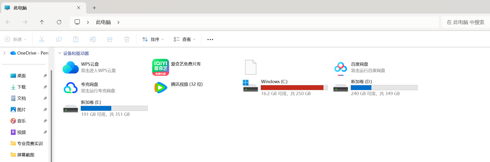
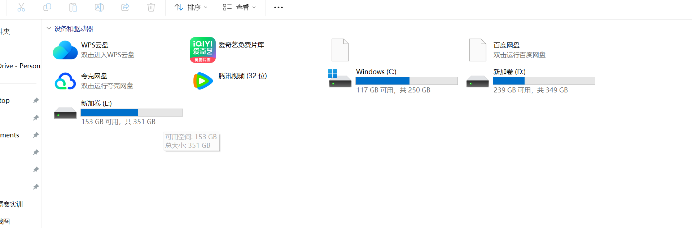

# win-disk-cleanup

Windows C 盘深度清理与 AppData 迁移工具集。

当你的 C 盘空间告急、AppData 膨胀、各种应用缓存占满磁盘时，这套脚本可以帮你系统性地清理垃圾，并将大文件夹通过 NTFS Junction 透明迁移到副盘，应用完全无感知。

所有脚本都是纯 PowerShell，无需安装任何依赖，直接在终端运行即可。

## 效果展示

以下是实际清理效果对比（清理 + Junction 迁移后）：

| 清理前 | 清理后 |
|:---:|:---:|
|  |  |
| C 盘可用：**16.2 GB** / 250 GB | C 盘可用：**117 GB** / 250 GB |

释放约 **100 GB** 空间。

## 快速开始

```powershell
# 1. 克隆仓库
git clone https://github.com/Rex-LX/win-disk-cleanup.git
cd win-disk-cleanup

# 2. 先扫描，看看 C 盘空间都被谁吃了
powershell -ExecutionPolicy Bypass -File scripts/scan_disk.ps1

# 3. 快速清理一波（临时文件 + 浏览器缓存 + 回收站）
powershell -ExecutionPolicy Bypass -File scripts/clean_caches.ps1 -Mode basic

# 4. 还想清更多？深度模式清理应用缓存（网易云、夸克、B站、抖音、Steam 等）
powershell -ExecutionPolicy Bypass -File scripts/clean_caches.ps1 -Mode deep

# 5. 把 AppData 大文件夹迁移到 D 盘（根治）
powershell -ExecutionPolicy Bypass -File scripts/check_running.ps1        # 先检查哪些应用在跑
powershell -ExecutionPolicy Bypass -File scripts/migrate_junctions.ps1     # 执行迁移
powershell -ExecutionPolicy Bypass -File scripts/verify_junctions.ps1      # 验证迁移结果
```

## 功能概览

整套工具分三个阶段，可以按需单独使用，也可以依次执行：

**Phase 1 — 基础清理**：清理临时文件（%TEMP%、Windows\Temp）、浏览器缓存（Chrome/Edge）、缩略图缓存、pip 缓存和回收站，快速释放空间。

**Phase 2 — 深度分析与清理**：扫描 C 盘空间占用情况，列出 AppData 中的大文件夹、已安装程序、各类应用缓存（微信、网易云、夸克、B 站、抖音、Steam 等），由你决定清理哪些。

**Phase 3 — Junction 迁移**：将 AppData 中的大文件夹透明迁移到 D 盘（或其他副盘），通过 NTFS Junction 让应用完全无感知，从根本上解决 C 盘被吃满的问题。同时支持 npm/yarn/pip 缓存路径迁移。

## 目录结构

```
win-disk-cleanup/
├── SKILL.md                        # AI Agent Skill 定义（可选）
├── README.md
├── LICENSE
├── images/
│   ├── before.png                  # 清理前截图
│   └── after.png                   # 清理后截图
└── scripts/
    ├── scan_disk.ps1               # 磁盘空间扫描与报告
    ├── clean_caches.ps1            # 缓存清理（支持 basic/deep 模式）
    ├── check_running.ps1           # 迁移前检查运行中的应用
    ├── migrate_junctions.ps1       # 批量迁移 + 创建 Junction
    └── verify_junctions.ps1        # 验证 Junction 完整性
```

## 脚本说明

### scan_disk.ps1

扫描磁盘空间占用，输出 C/D/E 盘概览、C 盘顶层大文件夹、AppData\Local 和 Roaming 中超过 50MB 的文件夹（标注 Junction 状态）、用户目录 dotfolder、以及各类可清理项的大小。

```powershell
powershell -ExecutionPolicy Bypass -File scripts/scan_disk.ps1
```

### clean_caches.ps1

清理缓存文件，支持两种模式：

- `basic`（默认）：清理临时文件、浏览器缓存、缩略图、pip 缓存、回收站
- `deep`：在 basic 基础上增加应用缓存（网易云、夸克、B 站、抖音、Steam 等）和 updater 残留

```powershell
powershell -ExecutionPolicy Bypass -File scripts/clean_caches.ps1 -Mode basic
powershell -ExecutionPolicy Bypass -File scripts/clean_caches.ps1 -Mode deep
```

### check_running.ps1

迁移前检查目标应用是否在运行（微信、QQ、Chrome、VS Code、Steam 等），列出需要关闭的应用，避免迁移时文件被锁定。

```powershell
powershell -ExecutionPolicy Bypass -File scripts/check_running.ps1
```

### migrate_junctions.ps1

批量迁移文件夹并创建 NTFS Junction。流程：robocopy 复制 → 校验目标大小 → 删除源 → mklink /J 创建 Junction → 验证。默认目标路径为 `D:\AppData`。

```powershell
powershell -ExecutionPolicy Bypass -File scripts/migrate_junctions.ps1 -targetRoot "D:\AppData"
```

### verify_junctions.ps1

验证所有已创建的 Junction 是否完好，检查缓存环境变量（YARN_CACHE_FOLDER、PIP_CACHE_DIR、npm cache）是否正确指向。

```powershell
powershell -ExecutionPolicy Bypass -File scripts/verify_junctions.ps1
```

## 注意事项

- 所有脚本需要以 PowerShell 执行（`-ExecutionPolicy Bypass`），建议以管理员身份运行
- 基础清理会跳过 `%TEMP%` 中的 `qoder-cli` 子目录
- Junction 迁移前请务必关闭相关应用，`check_running.ps1` 会自动检查并提示
- `Microsoft`、`Packages`、`Programs` 等系统关键目录不会被迁移
- 迁移失败的文件（因锁定）建议重启后重试
- 建议在执行前确保目标盘有足够空间

## AI Agent 集成（可选）

本工具封装了完整的 SKILL.md 流程定义，可以搭配各类 AI 编程/办公助手使用，通过自然语言驱动三阶段清理流程，无需手动跑脚本。

### QoderWork

安装方式：将整个 `win-disk-cleanup` 文件夹复制到 `~/.qoderworkcn/skills/` 目录下，重启 [QoderWork](https://qoder.com) 即可。之后直接说"帮我清理 C 盘"或"C 盘空间不够了"，Skill 会自动触发。

### Claude Code

安装方式：在 Claude Code 中打开本仓库目录，或使用 `/skill` 命令加载 `SKILL.md`。之后可以直接用自然语言描述清理需求，Claude Code 会按照 SKILL.md 定义的流程依次执行。

### OpenAI Codex CLI

安装方式：在 Codex CLI 的工作目录中放置 `AGENTS.md` 文件引用本仓库的 `SKILL.md`，或将 SKILL.md 内容写入你的项目指令文件。Codex 会读取指令并按流程执行清理任务。

---

AI 会依次引导你完成扫描、清理和迁移，每一步都会先向你确认再操作。

## License

MIT License — 详见 [LICENSE](LICENSE)
